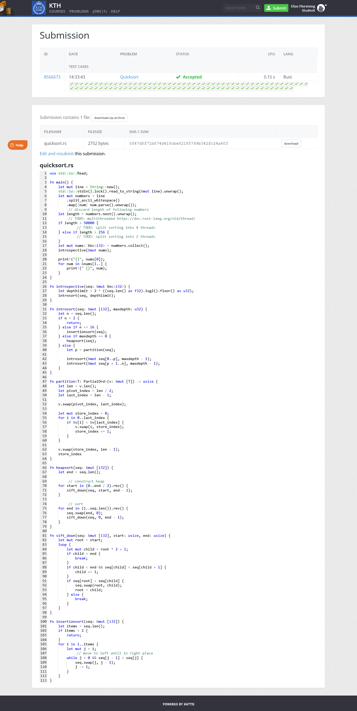

# eliasfl-quicksort

This is a introspection sort implementation that uses insertion sort for n <= 16 and heapsort when recursion depth is too deep, otherwise quicksort.

Works like a charm except that kattis has an ancient Rust version that doesn't have `select_nth_unstable()` nor the nightly version `partition_at_index()` 🤬

Got it working after some modification

## Kattis proof

## Useful links

### Kattis

- [Kattis assignment](https://kth.kattis.com/problems/kth.alginda.quicksort)
- [Kattis assignment statistics](https://kth.kattis.com/problems/kth.alginda.quicksort/statistics)

### Articles

- [Wikipedia Quicksort](https://www.wikiwand.com/en/Quicksort#/Hoare_partition_scheme)
- [Wikipedia Introsort](https://www.wikiwand.com/en/Introsort)
- [Multithreaded sorting benchmark](https://www.diva-portal.org/smash/get/diva2:839729/FULLTEXT02)
- [Introsort medium article](https://11dhanushs.medium.com/intro-sort-a-brief-introduction-f06b419674de)
- [GeeksForGeeks Introsort median of 3](https://www.geeksforgeeks.org/know-your-sorting-algorithm-set-2-introsort-cs-sorting-weapon/)
- [GeeksForGeeks Introsort](https://www.geeksforgeeks.org/introsort-or-introspective-sort/)
- [GeeksForGeeks Quicksort](https://www.geeksforgeeks.org/quick-sort/)
- [Stackoverflow Median of 3](https://stackoverflow.com/a/55242934/10767416)
- [Introsort benchmark (with good tests, Youtube)](https://www.youtube.com/watch?v=Xwo3Ibghwi0)
- [Benchmark for different sizes](http://warp.povusers.org/SortComparison/integers.html)
- [Quicksort in Rust](https://www.hackertouch.com/quick-sort-in-rust.html)
- [Rust std sort](https://doc.rust-lang.org/stable/src/core/slice/sort.rs.html)
- [Rust Rosettacode Quicksort](https://rosettacode.org/wiki/Sorting_algorithms/Quicksort#Rust)
- [Rust median of three quicksort crate](https://docs.rs/median_three_quicksort/latest/src/median_three_quicksort/quicksort.rs.html#1-79)
- [Rust pdqsort crate](https://docs.rs/pdqsort/latest/src/pdqsort/lib.rs.html#1-896)
- [pdqsort original implementation](https://github.com/orlp/pdqsort)

### Improved algorithms for large numbers

- [Non-comparison algorithms](https://www.wikiwand.com/en/Sorting_algorithm#/Non-comparison_sorts)
- [Spreadsport](https://www.wikiwand.com/en/Spreadsort)
- [Boost c++ sort](https://www.boost.org/doc/libs/1_78_0/libs/sort/doc/html/index.html)
- [Boost spreadsort docs](http://man.hubwiz.com/docset/Boost.docset/Contents/Resources/Documents/boost/libs/sort/doc/html/sort/single_thread/spreadsort/sort_hpp/rationale/why_spreadsort.html)
- [Boost integer sort (spreadsort)](http://man.hubwiz.com/docset/Boost.docset/Contents/Resources/Documents/boost/libs/sort/doc/html/boost/sort/spreadsort/integer__idm46326475777776.html)
- [Optimized rust radix sort](https://crates.io/crates/voracious_radix_sort)
- [American flag sort](https://www.wikiwand.com/en/American_flag_sort)
- [Rust radix sort](https://github.com/crepererum/rdxsort-rs)
- [RUst radix sort article](https://chercher.tech/rust/radix-sort-rust)
