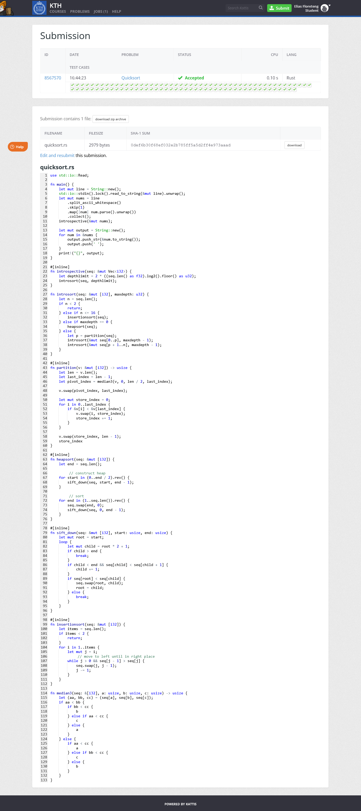

# eliasfl-quicksort

This is a introspection sort implementation that uses insertion sort for n <= 16 and heapsort when recursion depth is too deep, otherwise quicksort.

Works like a charm except that kattis has an ancient Rust version that doesn't have `select_nth_unstable()` nor the nightly version `partition_at_index()` 🤬

Got it working after some modification

## Kattis proof

